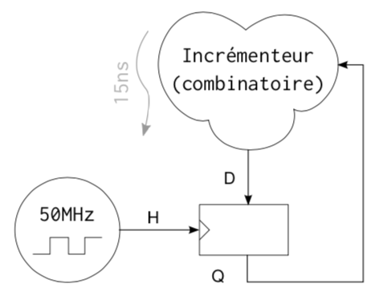

# Simulation Évenementielle

---

## Conditions Initiales

- 50MHz de fréquence d’horloge
- 15ns de temps de propagation.

| P1                                 | P2                            | P3                     |
| ---------------------------------- | ----------------------------- | ---------------------- |
| H <= 0; #10; H <= 1; #10; | @(H); if H ==1  Q <= D; | @(Q); D <= #15 Q+1; |

## Simulation du Parallélisme

| Temps Symbolique | Temps Physique | Processus             | D   | H   | Q   |
| ---------------- | -------------- | --------------------- | --- | --- | --- |
| $\Delta$         |                | P1 P2 P3 Fin |     |     |     |
|                  |                |                       |     |     |     |
